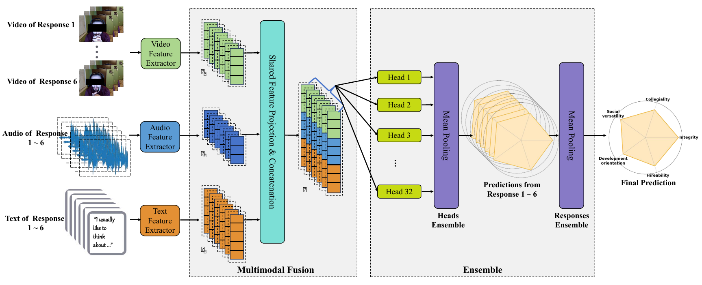
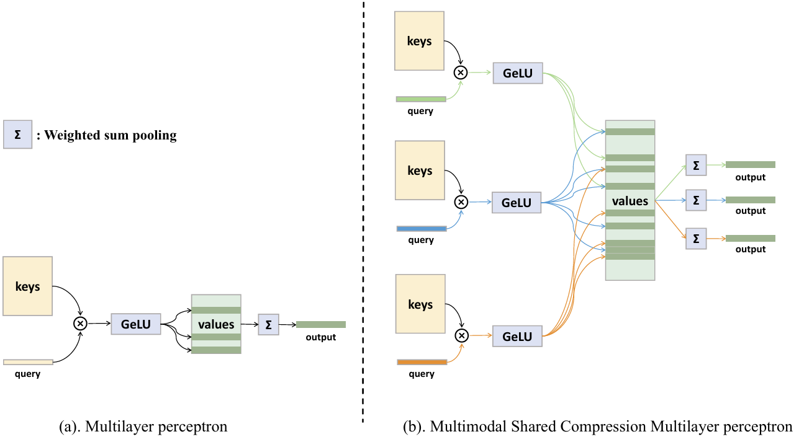

#  Listening to the Unspoken: Exploring "365" Aspects of Multimodal Interview Performance Assessment

**[MM 2025]** The official implementation for the paper titled: "Listening to the Unspoken: Exploring '365' Aspects of Multimodal Interview Performance Assessment"

🏆 Championship Solution of ACM Multimedia AVI Challenge 2025 Track 2: Interview Performance Assessment

## 🎯 Project Overview

The task of Interview Performance Assessment is a multi-input, multi-label regression task. Given videos in which subjects respond to both generic and personality questions, the objective is to develop models and algorithms to evaluate five job-related competencies:

- Integrity
- Collegiality
- Social versatility
- Development orientation
- Overall hireability

## 📊 Leaderboard


| **Team Name**       | **MSE (↓)** |
|---------------------|--------------------|
| **HFUT-VisionXL (our)**    | **0.18240 (1)**    |
| CAS-MAIS             | 0.18510 (2)        |
| ABC-Lab              | 0.19394 (3)        |
| The innovators	   | 0.20749 (4) 		|
| HSEmotion            | 0.22150 (5)        |
| USTC-IAT-United      | 0.24828 (6)       |
| DERS                 | 0.25540 (7)        |

## 🧱 Model Framework

<figure>
  
  <figcaption style="text-align: center; font-style: italic;"><b>Figure 1:</b> The overall model framework.</figcaption>
</figure>

<figure>
  
  <figcaption style="text-align: center; font-style: italic;"><b>Figure 2:</b> Multimodal Shared Compression Multilayer Perceptron (MSCMLP)</figcaption>
</figure>

## ⚙️ Directory Structure

``` text
track2/
├─ args_log/                           # Stores parameter configs for each experiment run
│  └─ .gitkeep
├─ data/
│  ├─ all_data.csv                     # CSV file containing both training and test data
│  ├─ test_data_basic_information.csv  # Test set CSV file
│  ├─ train_data.csv                   # Training set CSV file
│  ├─ val_data.csv                     # Validation set CSV file
│  └─ val_data_new.csv                 # CSV file with redundant columns removed
├─ dataset/
│  └─ baseline_dataset2_vote.py        # Dataset class for track2
├─ img/                                # Stores loss curve plots
│  └─ .gitkeep
├─ model/
│  └─ vote_model/
│     └─ M_model.py                    # Model implementation
├─ train_print_log/
│  └─ .gitkeep
├─ .gitignore
├─ README.md
├─ requirement.txt
├─ train_task2_vote.py
└─ vote_train.sh                       # Script to run training

```


## 📋 License

This project is licensed under the MIT License - see the LICENSE file for details.

## 📞 Contact

If you have any questions or suggestions, please contact the project maintainers (HFUT-VisionXL).

---

⚠️ **Note**: This project is for academic research purposes only. Please comply with relevant data usage agreements and competition rules.

## 🙏 Acknowledgments

- 🏆 Thanks to the AVI Challenge 2025 organizers
- 🤗 Thanks to the developers of [MERtools](https://github.com/zeroQiaoba/MERTools) for their excellent open-source tools that supported our data preprocessing.
